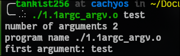
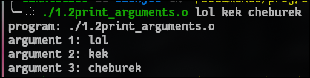
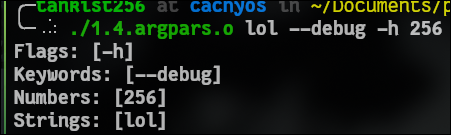
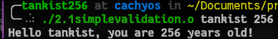
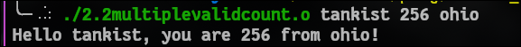
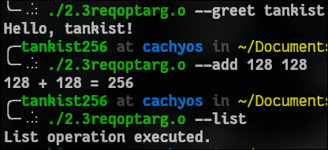

# Complete argc/argv Learning Journey - 5 Hour Course

## LEVEL 1: GETTING STARTED (30 minutes)

### Task 1.1:
usage: `./1.1argc_argv.o test`

---

### Task 1.2: 
usage `./program lol kek cheburek`

---

### Taks 1.4 
usage: `./program lol --debug -h 256`
output: `flags:[-h] keywords:[--debug] numbers:[256] strings:[lol]`

---

## LEVEL 2:

### Task 2.1: 

usage: `./program <name> <age>`

output: `Hello [name], you are [age] years old!`

___ 

### Task 2.2:

usage: `./program <name> <age> <city>`

output: `Hello [name], you are [age] years old from [city]!`

---

### Task 2.3: Required vs Optional Arguments

Usage: `./program <operation> [<args>]`

`Operations:`

  `--greet <name>`

  `--add <number1> <number2>`

  `--list`

---

## TASK 3

### Task 3.1: Simple Calculator

usgae: `./program 128 + 128`

output: `128 + 128 = 256`

---

### Task 3.2:
---

### Task 3.3: 
---

### Task 3.4: 
---

## LEVEL 4: STRING PROCESSING

### Task 4.1:
---

### Task 4.2:
---

### Task 4.3:
---

## LEVEL 5:

### Task 5.1: 
---

### Task 5.2:
---

### Task 5.3: 
---

### Task 5.4: 
---

## TASK 6

### Task 6.1:
---

### Task 6.2: 
---

### Task 6.3: 
---

### Task 6.4: 
---