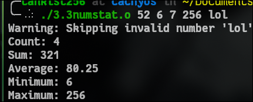

## TASKS 1:

### Task 1.1:
usage: `./1.1argc_argv.o test`

---

### Task 1.2: 
usage `./program lol kek cheburek`

---

### Taks 1.4 
usage: `./program lol --debug -h 256`
output: `flags:[-h] keywords:[--debug] numbers:[256] strings:[lol]`

---

## TASKS 2:

### Task 2.1: 

usage: `./program <name> <age>`

output: `Hello [name], you are [age] years old!`

___ 

### Task 2.2:

usage: `./program <name> <age> <city>`

output: `Hello [name], you are [age] years old from [city]!`

---

### Task 2.3:

Usage: `./program <operation> [<args>]`

`Operations:`

  `--greet <name>`

  `--add <number1> <number2>`

  `--list`

---

## TASKS 3

### Task 3.1:

usgae: `./program 50 + 2`

output: `52` 

---

### Task 3.2:
usage: `./program 10 20 22` 

output: `52`

---

### Task 3.3: 
usage: `./program 52 6 7 256 `

output: `Count: 4
Sum: 321
Average: 80.25
Minimum: 6
Maximum: 256`

---

## TASKKS 4:

### Task 4.1:
usage: `./program 123456789 lol kek cheburek!`

output: `123456789: 9
lol: 3
kek: 3
cheburek!: 9
Total: 24`

---

### Task 4.2:
example usage: `./program upper lolkek cheburek`

output: `LOLKEK CHEBUREK`

---

### Task 4.3:
usage:`./program word yourtext`

output: `yourword`

---

## TASKS 5:

### Task 5.1: 
usage:

output:

---

### Task 5.2:
usage:

output:

---

### Task 5.3: 
usage:

output:

---

### Task 5.4: 
usage:

output:

---

## TASKS 6

### Task 6.1:
usage:

output:

---

### Task 6.2: 
usage:

output:

---

### Task 6.3: 
usage:

output:

---

### Task 6.4: 
usage:

output:

---